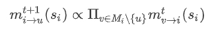
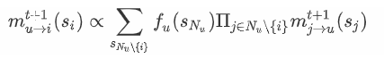
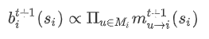
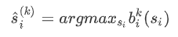
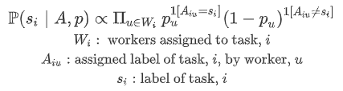
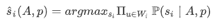
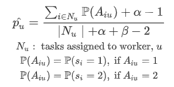

# WorkerModel

Crowdsourcing에서 true label을 얻기 위해서는 여러 worker들이 각 task들에 할당한 label들을 수집해 true label을 추정함

하지만, 모든 worker들이 task에 정확하게 label을 부여하지는 않기 때문에 WorkerModel을 설계할 필요가 있음

가장 단순한 방법인 MV 방법과 MV의 단점을 보완한 BP, EM 알고리즘을 사용해 WokerModel을 구현

## MV(Majority Voting)

각 task들에 대해 할당된 worker들이 부여한 label 중 가장 많은 worker들이 선택한 label을 true label로 사용함

Worker들의 reliability를 고려하지 않고, 모든 worker들을 동일하게 취급하기 때문에 가장 단순한 방법이지만 정확도가 떨어지는 단점이 존재함

## BP(Belief Propagation)

Worker를 factor로 지정하고 task를 variable로 지정해서 factor graph를 생성함

매 iteration마다 아래와 같이 message를 전달함

Task 에서 worker 에게 message를 전달함, 즉, 의 reliability를 update함

이 값은 이전 time step 에서 가 연결된 worker들에게 받은 message 값들의 product로 추정함

Worker 에서 task 에게 message를 전달함, 즉, 의 label을 update함

이 값은 time step 에서 가 연결된 task들에게 받은 message와 factor 값의 곱의 sum으로 추정함

Task들의 belief를 update함, 즉, 각 task들의 label의 확률들이 어느정도의 신뢰성이 있는지를 추정함

이 값은 time step 에서 가 연결된 worker들에게 받은 message 값들의 product로 추정함

번의 iteration 후의 task 의 label은 의 belief 를 최대화하는 값으로 할당함

## EM(Expectation Maximization)

Prior인 worker들의 reliability 가 beta distribution을 따른다고 가정함

### E-step

E-step에서는 아래와 같이 를 고정시키고 의 확률을 추정함

Task 의 label은 다음과 같이 추정함

### M-step

M-step에서는 E-step에서 계산한 의 확률을 사용해 새로운 를 추정함

추정한 값을 통해 worker 의 reliability를 update함

## Data

각 worker에 연결된 task의 수 에 변화를 주는 SYN dataset과 각 task에 연결된 worker의 수 에 변화를 주는 SIM dataset을 사용

**대학 과목의 project에 사용했던 data이기 때문에 data는 공개하지 않음**

## 결과

SYN dataset에서는 각 worker에 연결된 task 수 을 으로 변화시키며 MV, BP, EM 알고리즘에 대해 error rate를 측정함

이 증가해도 MV 알고리즘의 성능은 향상되지 않는 것을 확인

BP와 EM 알고리즘은 이 증가할 수록 성능이 향상됨

SIM dataset에서는 각 task에 연결된 worker 수 을 으로 변화시키며 MV, BP, EM 알고리즘에 대해 error rate를 측정함

BP 알고리즘을 naive하게 구현해서 이 증가하면 시간이 오래걸려 BP 알고리즘에 대해서는 이  일 때만 error rate를 측정함

이 증가하면 MV 알고리즘을 포함해 모두 성능은 향상되는 것을 확인
